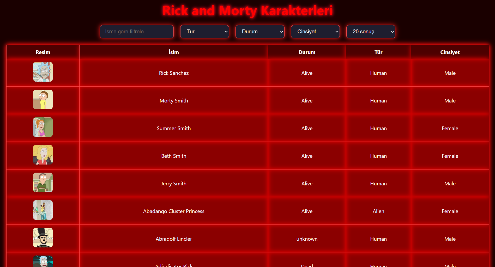

# Rick and Morty Karakter Tablosu
## 🌐 Canlı Demo
Projeyi GitHub Pages üzerinden inceleyebilirsiniz:  
👉 [rick-and-morty-table](https://aysenur-candan.github.io/rick-and-morty-table/)


Bu proje, [Rick and Morty API](https://rickandmortyapi.com/) kullanılarak React ile geliştirilmiş, filtreleme, sıralama ve sayfalama özelliklerine sahip bir karakter tablosudur.


## 🎯 Proje Amacı

Frontend geliştirme becerilerimi göstermek, API kullanımı, veri işleme ve kullanıcı dostu arayüz oluşturma konularında deneyim kazanmak amacıyla bu projeyi geliştirdim.

## 🔧 Özellikler

- İsme göre filtreleme  
- Duruma göre filtreleme (Alive, Dead, Unknown)  
- Cinsiyete göre filtreleme (Female, Male, Genderless, Unknown)  
- Sayfa başına gösterilecek sonuç sayısının ayarlanması  
- Sayfalama (Pagination)  
- Karakter satırına tıklanınca detaylı bilgilerin gösterilmesi  
- Uygun filtre sonucu yoksa kullanıcıya bilgi verilmesi  
- API hataları için kullanıcıya hata mesajı gösterilmesi

## 🧰 Kullanılan Teknolojiler

- React (Create React App)
- JavaScript
- Axios
- Rick and Morty API

## 🚀 Projeyi Çalıştırmak İçin

```bash
git clone https://github.com/aysenur-candan/rick-and-morty-table.git
cd rick-and-morty-table
npm install
npm start
```

# Rick and Morty Karakter Tablosu

Bu proje, [Rick and Morty API](https://rickandmortyapi.com/) kullanılarak oluşturulmuş filtrelenebilir, sıralanabilir ve sayfalama özelliklerine sahip bir karakter tablosudur.


## 🚀 Özellikler

- 🔍 İsme, duruma ve cinsiyete göre filtreleme
- 🔢 Sayfalama
- 📋 Detay görünümü: Her karaktere tıklanarak detay bilgileri gösterilir
- ✅ Temiz ve okunaklı React kod yapısı

## 🛠️ Kullanılan Teknolojiler

- React
- Axios
- JavaScript (ES6)
- HTML5 & CSS3

## 🙋‍♀️ Hakkımda

Ben **Ayşenur Candan**. Kayseri Üniversitesi Bilgisayar Mühendisliği 2. sınıfı tamamladım.  
Bu proje, **zorunlu yaz stajım** kapsamında özenle ve isteyerek geliştirilmiştir.

Yeni teknolojilere meraklı, öğrenmeye açık ve sorumluluk almaktan çekinmeyen biriyim.  
Bu projeyi tamamlarken çok şey öğrendim ve gelişmeye devam ediyorum.  
🎯 Geri bildirimleriniz benim için çok kıymetli!

## 📩 İletişim

Her türlü soru ve geri bildirim için bana ulaşabilirsiniz:

- ✉️ aysenurcandan10@gmail.com
- 🔗 [LinkedIn Profilim](https://www.linkedin.com/in/aysenur-candan/)

---


