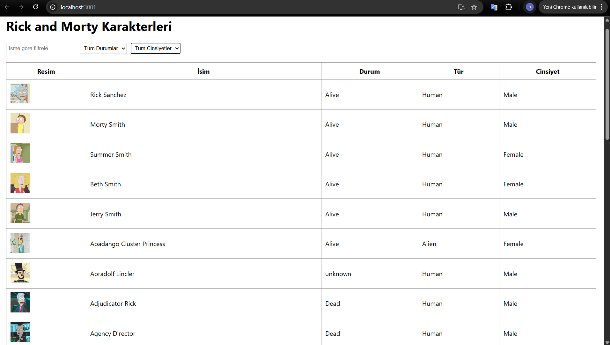
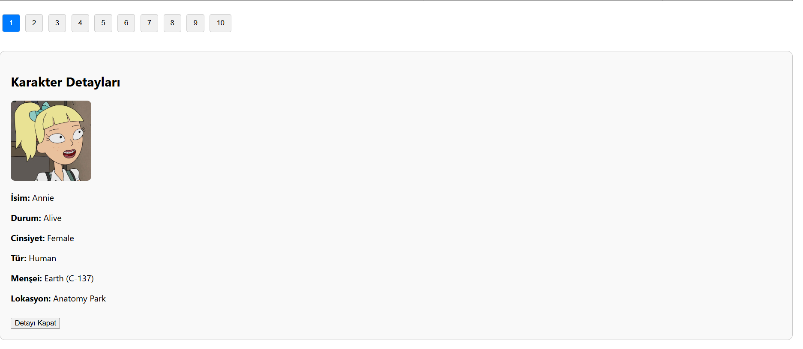

# Rick and Morty Karakter Tablosu

Bu proje, [Rick and Morty API](https://rickandmortyapi.com/) kullanılarak React ile geliştirilmiş, filtreleme, sıralama ve sayfalama özelliklerine sahip bir karakter tablosudur.

## 🎯 Proje Amacı

Frontend geliştirme becerilerimi göstermek, API kullanımı, veri işleme ve kullanıcı dostu arayüz oluşturma konularında deneyim kazanmak amacıyla bu projeyi geliştirdim.

## 🔧 Özellikler

- İsme göre filtreleme  
- Duruma göre filtreleme (Alive, Dead, Unknown)  
- Cinsiyete göre filtreleme (Female, Male, Genderless, Unknown)  
- Sayfa başına gösterilecek sonuç sayısının ayarlanması  
- Sayfalama (Pagination)  
- Karakter satırına tıklanınca detaylı bilgilerin gösterilmesi  
- Uygun filtre sonucu yoksa kullanıcıya bilgi verilmesi  
- API hataları için kullanıcıya hata mesajı gösterilmesi

## 🧰 Kullanılan Teknolojiler

- React (Create React App)
- JavaScript
- Axios
- Rick and Morty API

## 🚀 Projeyi Çalıştırmak İçin

```bash
git clone https://github.com/aysenur-candan/rick-and-morty-table.git
cd rick-and-morty-table
npm install
npm start

